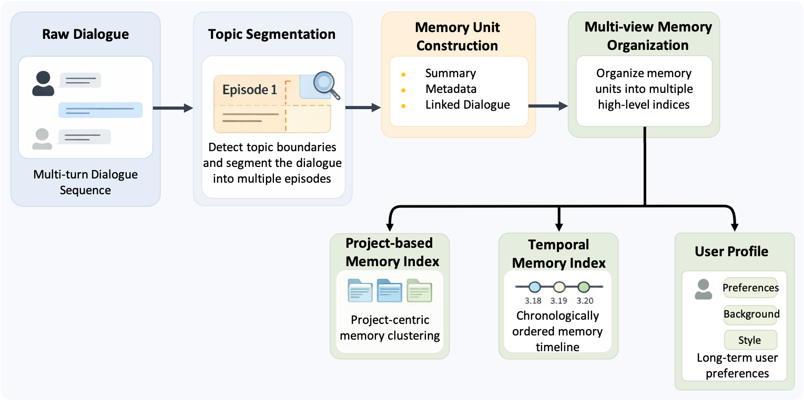
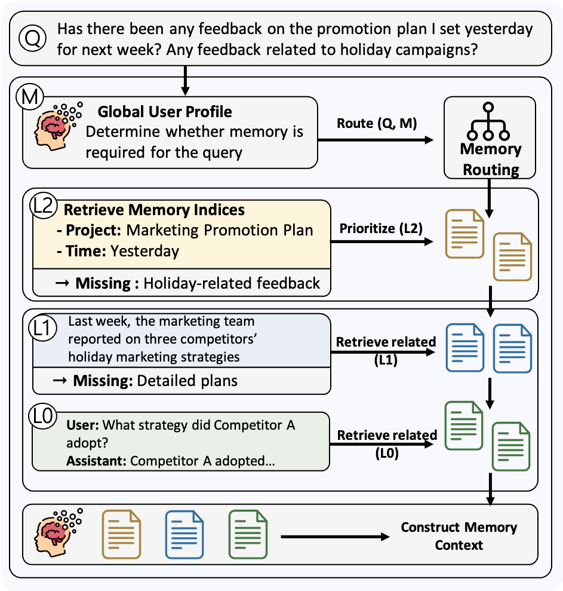

<p align="center">
  <picture>
    
  </picture>
</p>

<p align="center">
  <b>A Multi-Level Memory System for Long-Term Context</b>
</p>

<p align="center">
  <a href="./docs/README_zh.md"><b>简体中文</b></a> &nbsp;|&nbsp; <b>English</b>
</p>

---

## 📖 About ClawXMemory

ClawXMemory is a memory system jointly developed by Tsinghua University's THUNLP Lab, OpenBMB, ModelBest, and AI9Stars.

Built on EdgeClaw's native long-term memory capability, it introduces a deeply structured abstraction and systematic extension of the memory mechanism, then plugs into the OpenClaw ecosystem through a plugin-based design. ClawXMemory is not just a simple accumulation of historical context for large models. Instead, it provides a structured, multi-level, and evolvable long-term memory system. During conversations, the system gradually distills scattered information into memory fragments, then further aggregates them into project memory, timeline memory, and user profiles. When generating a response, the model actively reasons and navigates along this "memory tree," bringing only genuinely useful and highly relevant context into the current conversation.

To address what to remember, how to organize it, and how to actually make memory usable, ClawXMemory provides three core capabilities:

- **Structured multi-level memory system**: Move beyond flat history logs. The system progressively extracts and aggregates raw conversations (L0) into memory fragments (L1) and higher-level memories (L2), building a richer memory structure that keeps growing and evolving with user interaction.
- **Model-driven selection and reasoning**: Instead of relying on rigid vector retrieval, ClawXMemory lets the model actively "think" along the memory index, locating and reasoning over relevant context layer by layer.
- **Memory management and visualization**: A built-in visual dashboard offers both canvas and list views, making the hierarchy and relationships of memory easy to inspect. All data is stored locally in SQLite by default, with one-click import and export for seamless state migration across devices.

### ⚙️ How ClawXMemory Works

ClawXMemory can be summarized as: hierarchical memory construction + model-driven selection. It quietly turns everyday conversations into a structured knowledge base for long-term context modeling.

> [!TIP]
> **Example: continuously advancing a long-running task**
>
> If you use AI to iterate on a paper over time, earlier discussions do not disappear when the context window refreshes, nor do they turn into disconnected text fragments. Instead, the system automatically consolidates them into the current state of that project.
>
> When you later ask, "What stage am I at now?", the system answers directly from that structured state instead of searching for a needle in a haystack across historical chats.

#### 1. Building the multi-level memory index

During memory construction, ClawXMemory takes the conversation stream as input and silently refines and organizes information layer by layer in the background:

| Memory level | Type | Meaning |
| :--- | :--- | :--- |
| **L2** | **Project Memory** | Long-term high-level memory aggregated around a specific topic or task |
| **L2** | **Time Memory** | Periodic memory aggregated along a timeline, such as by day or week |
| **L1** | **Memory Fragments** | Structured core summaries generated for closed topics |
| **L0** | **Raw Conversation** | The lowest-level original message records |
| **Global** | **Profile** | A continuously updated singleton global user profile |

The whole process requires no manual action. You can stay focused on natural conversation and task progress: short-term context handles the current multi-turn exchange, while ClawXMemory turns those experiences into reusable long-term assets in the background.

<p align="center">
  <picture>
    
  </picture>
</p>

#### 2. Model-driven memory selection and reasoning

The pain point of traditional memory systems is often not the lack of memory, but the fact that they have retrieval without understanding. When a user asks questions like "What stage is this project at now?", "How did we finalize that plan last week?", or "Didn't you remember that I prefer Chinese wording?", the real challenge is not just finding a highly similar text snippet. It is whether the system knows which part of memory to inspect, and how deeply it needs to dig.

ClawXMemory addresses this by turning passive retrieval into active reasoning. The model explores the multi-level memory structure on its own. It first evaluates relevance from higher-level memory such as project memory, time memory, or user profile. Only when that is not enough does it drill down into finer-grained memory fragments, and when necessary it can even trace back to a specific raw conversation.

<p align="center">
  <picture>
    
  </picture>
</p>

This process is closer to how a human expert would progressively reason along memory structure than how a database would blindly run `SELECT *`. What finally enters the model generation step is no longer a long history packed in as much as possible, but carefully filtered context that is truly relevant. In short, ClawXMemory is not trying to solve "how to stuff more history into the prompt," but "how to accurately extract and use the long-term context that actually matters."

---

## Quick Start

### Installation

Prerequisites: OpenClaw and Node.js are already installed.

```bash
# Install from npm
npm install openbmb-clawxmemory

# Or install from ClawHub
openclaw plugins install clawhub:openbmb-clawxmemory
```

### Development and Debugging

If you need to modify code or debug the plugin, install from source:

```bash
git clone https://github.com/OpenBMB/ClawXMemory.git
cd ClawXMemory
cd clawxmemory
npm install
npm run relink
```

Common development commands. Run them in `clawxmemory/`:

```bash
# Link the current repo into local OpenClaw for the first time
npm run relink

# Rebuild and reload after changing src/ or ui-source/
npm run reload

# Optional: keep compiling the plugin continuously
npm run dev

# Type checking
npm run typecheck

# Run tests
npm run test

# Debug the memory retrieval flow
npm run debug:retrieve -- --query "project progress"

# Inspect npm package contents before release
npm run pack:check

# Remove the plugin and restore native OpenClaw memory ownership
npm run uninstall
```

### Uninstall

If you want to remove the plugin, run:

```bash
npm run uninstall
```

You should also manually delete the extension directory that OpenClaw may leave on disk:

```bash
rm -rf ~/.openclaw/extensions/openbmb-clawxmemory
```

### Installation Verification

Run the following commands to check plugin status:

```bash
openclaw plugins inspect openbmb-clawxmemory --json
openclaw gateway status --json
```

Please confirm:

- `openbmb-clawxmemory` has `status: loaded`
- `plugins.slots.memory` points to `openbmb-clawxmemory`
- the gateway is running normally

### UI Access

Open:

```text
http://127.0.0.1:39393/clawxmemory/
```

If port `39393` is already in use on your machine, explicitly set `uiPort` in the OpenClaw plugin config:

```json
{
  "plugins": {
    "entries": {
      "openbmb-clawxmemory": {
        "config": {
          "uiPort": 40404
        }
      }
    }
  }
}
```

---

### Contributing

You can contribute through the standard process: **Fork this repository -> open an Issue -> submit a Pull Request (PR)**.

If this project helps your research, a star is appreciated.

---

## 📮 Contact

<table>
  <tr>
    <td>📋 <b>Issues</b></td>
    <td>For technical problems and feature requests, please use <a href="https://github.com/OpenBMB/ClawXMemory/issues">GitHub Issues</a>.</td>
  </tr>
  <tr>
    <td>📧 <b>Email</b></td>
    <td>If you have any questions, feedback, or would like to get in touch, email us at <a href="mailto:yanyk.thu@gmail.com">yanyk.thu@gmail.com</a>.</td>
  </tr>
</table>
