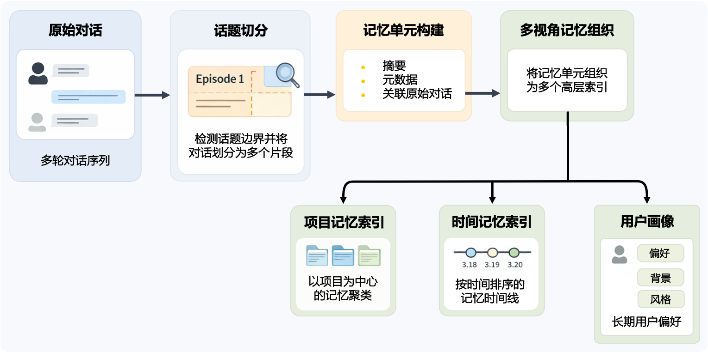
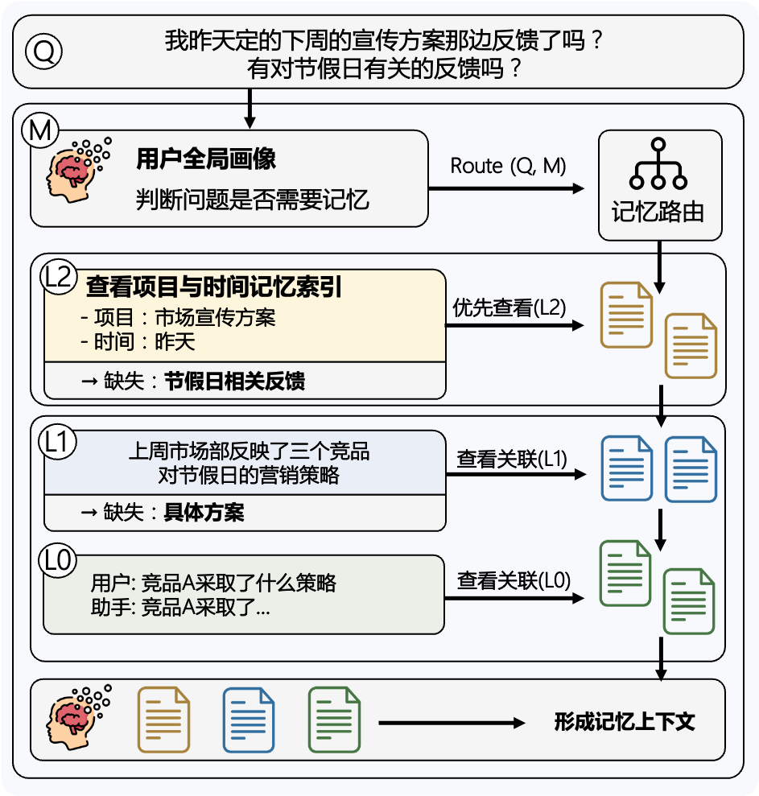

<p align="center">
  <picture>
    
  </picture>
</p>

<h3 align="center">
记忆即结构
</h3>

<p align="center">
  <b>简体中文</b> &nbsp;|&nbsp; <a href="../README.md"><b>English</b></a>
</p>

---

## 📖 关于 ClawXMemory

ClawXMemory 是一个由清华大学 THUNLP 实验室、OpenBMB、面壁智能与 AI9Stars 联合发布的记忆系统。该系统基于 EdgeClaw 已内生的长期记忆能力，对其记忆机制进行了结构化抽象与系统化扩展，并进一步完成插件化设计，使其能够无缝接入 OpenClaw 生态，成为可复用的通用记忆模块。ClawXMemory 并非对现有记忆能力的简单增强，而是为 OpenClaw 引入一套结构化、多层次、可演化的长期记忆体系：系统在对话中将信息逐步沉淀为记忆片段，并持续聚合为项目记忆、时间线记忆与用户画像；在生成回答前，由模型沿记忆结构主动选择并逐层定位相关记忆，仅引入真正有用的上下文。

围绕“记住什么、如何组织、以及如何真正用起来”，ClawXMemory 提供了三个核心能力：

- 结构化多层记忆体系：将对话从 L0 → L1 → L2 逐层抽取与聚合，构建可持续演化的记忆结构，而非停留在扁平历史记录
- 模型驱动的选择与推理：不依赖传统检索机制，而是沿记忆索引主动选择相关记忆，并逐层定位与推理所需上下文
- 记忆管理与可视化：通过可视化看板提供画布视图与列表视图，使记忆结构与层级关系清晰可见；同时所有记忆存储于本地 SQLite，结合导入导出能力，可在不同设备间一键迁移完整记忆状态

---

## 📦 安装

### 环境要求

> [!NOTE]
> 在开始前，请确认：
>
> - Node.js `>= 24`
> - OpenClaw `>= 2026.3.22`
> - `openclaw` CLI 和 gateway 已正常可用

### 推荐方式：直接安装发布版本

> [!TIP]
> 这是最简单、最稳定的方式

```bash
openclaw plugins install clawhub:openbmb-clawxmemory
```

这个包也会同步发布到 npm：

```bash
npm install openbmb-clawxmemory
```

真正接入 OpenClaw 仍然推荐使用 `openclaw plugins install clawhub:openbmb-clawxmemory`；单独执行 npm install 更适合做包检查或自定义打包流程。

首次安装时，ClawXMemory 可能会自动改写受管的 OpenClaw memory 配置，并主动请求一次 gateway 重启。等待这次重启完成后，再检查 UI 和健康状态。

如果你的 OpenClaw 使用了 `tools.profile: "coding"` 或任何显式 allowlist，还需要把这三个 chat-facing tool 暴露给 agent；否则插件虽然已加载，模型侧仍然只能看到 `memory_search` / `memory_get`：

```json
{
  "tools": {
    "alsoAllow": ["memory_overview", "memory_list", "memory_flush"]
  }
}
```

安装完成后，建议检查状态：

```bash
openclaw plugins inspect openbmb-clawxmemory --json
```

如果 gateway 尚未启动：

```bash
openclaw gateway start
```

### 开发者模式：从源码安装（本地调试用）

适用于你需要改代码 / 调试插件的场景：

```bash
git clone https://github.com/OpenBMB/ClawXMemory.git
cd ClawXMemory
cd clawxmemory
npm install
npm run relink
```

#### relink 做了什么？

`relink` 会自动完成以下流程：构建插件、本地 link 到 OpenClaw、接管 memory slot、为 chat-facing memory tools 写入 `tools.alsoAllow`、重启 gateway 并做健康检查。

#### 使用独立配置

避免污染你当前 OpenClaw 环境：

```bash
cd clawxmemory
OPENCLAW_CONFIG_PATH=/path/to/openclaw.json npm run relink
```

#### 日常开发流程

- 首次接入 / 切换安装方式 / 清空 state
-> 用 `npm run relink`
- 仅修改代码后重新加载
-> 用 `npm run reload`

#### 卸载 / 干净重装

如果你想先把 memory ownership 交还给原生 OpenClaw，再测试另一条安装链路，可以执行：

```bash
npm run uninstall
```

`npm run uninstall` 会恢复 `memory-core` 为当前 memory slot，并移除插件配置与 install record。如果你后面要做一次真正干净的重装，还需要把 OpenClaw 可能残留在磁盘上的扩展目录手动删掉：

```bash
rm -rf ~/.openclaw/extensions/openbmb-clawxmemory
```

#### 发布前 smoke test

如果你想先验证“从本地源码安装”这条链路：

```bash
npm run uninstall
rm -rf ~/.openclaw/extensions/openbmb-clawxmemory
openclaw plugins install .
openclaw gateway restart
openclaw plugins inspect openbmb-clawxmemory --json
```

如果你想验证更接近真实发布物的安装链路，推荐测 `.tgz`：

```bash
npm pack
openclaw plugins install ./openbmb-clawxmemory-*.tgz
openclaw gateway restart
openclaw plugins inspect openbmb-clawxmemory --json
```

### 安装验证

执行以下命令检查插件状态：

```bash
openclaw plugins inspect openbmb-clawxmemory --json
openclaw gateway status --json
```

请确认：

- `openbmb-clawxmemory` 的 `status` 为 `loaded`
- `plugins.slots.memory` 已指向 `openbmb-clawxmemory`
- 网关运行正常

### UI 访问

打开浏览器：

```text
http://127.0.0.1:39393/clawxmemory/
```

### 端口冲突 / 自定义端口

默认 UI 地址是 `http://127.0.0.1:39393/clawxmemory/`。如果本机的 `39393` 已被占用，请在 OpenClaw 插件配置里显式设置 `uiPort`：

```json
{
  "plugins": {
    "entries": {
      "openbmb-clawxmemory": {
        "config": {
          "uiPort": 40404
        }
      }
    }
  }
}
```

默认配置文件位置是 `~/.openclaw/openclaw.json`。如果你使用隔离配置，例如：

```bash
cd clawxmemory
OPENCLAW_CONFIG_PATH=/path/to/openclaw.json npm run reload
```

那就修改这个 `OPENCLAW_CONFIG_PATH` 指向的文件，而不是默认配置文件。

同一段插件配置也继续支持：

- `uiHost`
- `uiPathPrefix`

修改后执行 `openclaw gateway restart`，或在开发环境执行 `npm run reload` / `npm run relink`。重新加载后，以脚本最终打印出来的 `UI` 地址为准；脚本会跟随当前实际配置的 `uiHost`、`uiPort` 和 `uiPathPrefix`。

### 卸载

只卸载插件：

```bash
openclaw plugins uninstall openbmb-clawxmemory --force
```

> [!WARNING]
> OpenClaw 只会移除插件安装记录、load path 与 slot 绑定，不会自动恢复 ClawXMemory 为避免冲突而关闭的原生 memory 相关配置。

完整卸载并恢复原生 memory：

```bash
npm run uninstall
```

如果你在隔离配置里做调试，可以显式指定配置文件：

```bash
cd clawxmemory
OPENCLAW_CONFIG_PATH=/path/to/openclaw.json npm run uninstall
```

---

## 🧠 ClawXMemory 是如何工作的

ClawXMemory 通过一个**分层记忆构建 + 模型驱动选择**的机制，将原始对话逐步转化为可用于长期上下文建模的结构化记忆系统。

例如，你在持续推进一篇论文时，每次讨论不会被遗忘或零散存储，而是逐步汇总成这个项目的“当前状态”。当你再次问“现在做到哪一步”时，系统直接基于这份状态给出答案，而不是去翻找过去的对话。

### 多层记忆索引构建

在记忆构建阶段，ClawXMemory 以对话为输入，在后台自动将信息逐层整理为结构化记忆：

| 列表层级         | 含义            |
| ------------ | ------------- |
| **项目记忆（L2）** | 按主题聚合后的长期项目记忆 |
| **时间记忆（L2）** | 按日期聚合后的时间记忆   |
| **记忆片段（L1）** | 已闭合话题的结构化摘要   |
| **原始对话（L0）** | 最原始的对话消息记录    |
| **个人画像**     | 单例个人画像记录      |

整个过程无需额外操作：你正常对话，系统自动沉淀；你持续推进任务，记忆结构也会随之更新。短期上下文负责当前这一轮回答，而 ClawXMemory 负责把这些对话转化为可以反复使用的长期上下文。

<p align="center">
  <picture>
    
  </picture>
</p>

### 模型驱动记忆选择与推理

很多系统的问题并不在于“没有记忆”，而在于只有检索，没有理解。当用户问出「我这个项目现在推进到哪一步了」「上周这个方案是怎么定的」「你不是知道我更偏好中文表达吗」这类问题时，难点从来不在于找到一段相似文本，而在于：系统是否知道该看哪一部分记忆，以及需要看多深。

ClawXMemory 的做法不是简单检索或拼接历史，而是由模型沿多层记忆结构进行主动选择：先从更高层的项目记忆、时间记忆或用户画像中判断哪些信息可能相关，只有在这些信息不足时，才会继续定位到更细粒度的记忆片段，必要时再回溯到具体对话。

<p align="center">
  <picture>
    
  </picture>
</p>

整个过程更像是在“沿着记忆结构逐步定位答案”，而不是在历史记录中盲目查找。最终进入当前回答的，不再是“尽可能多的历史”，而是真正与问题相关的上下文。换句话说，ClawXMemory 解决的不是“如何把更多历史塞进 prompt”，而是“如何只用真正有用的长期上下文”。

---

## 🛠️ 开发与调试

### 项目结构

```text
ClawXMemory/
├── clawxmemory/
│   ├── src/          # 核心逻辑（最重要）
│   ├── ui-source/    # 本地 UI（看板）
│   ├── tests/
│   ├── scripts/
│   └── openclaw.plugin.json
└── docs/
```

### 开发流程

以下命令都在 `clawxmemory/` 目录执行：

```bash
# 首次把当前仓库链接到本地 OpenClaw
npm run relink

# 修改 src/ 或 ui-source/ 后重建并重新加载
npm run reload

# 可选：持续编译插件
npm run dev

# 类型检查
npm run typecheck

# 运行测试
npm run test

# 调试记忆召回流程
npm run debug:retrieve -- --query "项目进展"

# 发布前检查 npm 包内容
npm run pack:check

# 移除插件并恢复 OpenClaw 原生 memory 接管
npm run uninstall
```

建议把开发与发布前检查分开执行：

- 本地联调阶段优先用 `relink` / `reload`，它们会负责构建、链接、同步配置和重启网关。
- 提交或发布前至少跑一次 `npm run typecheck`、`npm run test` 和 `npm run pack:check`。
- 如果需要在独立环境验证安装链路，可先在 `clawxmemory/` 目录执行 `npm pack`，再用生成的 `.tgz` 做一次 `openclaw plugins install` smoke test。
- OpenClaw `v2026.3.28` 新增了由 memory 插件接管的 pre-compaction memory flush 契约。ClawXMemory 已评估该变更，但当前版本仍故意保持宿主侧 `agents.defaults.compaction.memoryFlush` 关闭，等后续为 SQLite 型记忆设计专门的 durable-write 路径后再接入。

### 贡献

您可以通过以下标准流程来贡献：**Fork 本仓库 → 提交 Issue → 发起 Pull Request (PR)**。

---

## 📮 联系我们

<table>
  <tr>
    <td>📋 <b>Issues</b></td>
    <td>关于技术问题及功能请求，请使用 <a href="https://github.com/OpenBMB/ClawXMemory/issues">GitHub Issues</a> 功能。</td>
  </tr>
  <tr>
    <td>📧 <b>Email</b></td>
    <td>如果您有任何疑问、反馈或想与我们取得联系，请随时通过电子邮件发送至 <a href="mailto:yanyk.thu@gmail.com">yanyk.thu@gmail.com</a>。</td>
  </tr>
</table>
